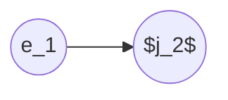

# matching-algorithms
Implementation of the Gale-Shapley (also known as deferred acceptance) and Top Trading Cycle (TTC) algorithms for 2-sided matching.

# Gale-Shapley (Deferred Acceptance) Algorithm
First published in 1962 by David Gale and Lloyd Shapley, the Gale-Shapley algorithm is an algorithm used for finding a solution to the stable matching problem. It runs in polynomial time, but the time is linear in the size of the inputs. It is a truthful mechanism and is optimal from the point of view of the proposing participants. ([source](https://en.wikipedia.org/wiki/Gale%E2%80%93Shapley_algorithm)). 

Let's suppose we are trying to match employees to available jobs, where employees have strict preferences over all available jobs, and jobs have strict preferences over all available employees. One of the beautiful properties of the deferred acceptance algorithm is that it is guaranteed to produce a stable matching of employees to jobs. A stable match is one in which there are no blocking pairs present in the final matching. A pair `(e, j)` is called a blocking pair for a final matching if both `e` and `j` prefer each other more than their assigned match.

## Algorithm
1. Each employee proposes to the highest remaining job on their list.
2. Jobs tentatively accept proposals based on their preferred offer (forming "tentative matches"), and reject other offers, or all offers if none are acceptable.
3. Each rejected employee removes that job from their list, and makes a new offer to the next highest job on their list.
4. Go back to step 1 and repeat until there are no more offers or rejections (i.e., either all employees are matched OR we have exhausted all preference lists for all employees), at which point make permanent all tentative matches. 

Note that the algorithm is "employee-optimal" (each employee gets their best outcome in any stable matching) and "job-pessimal" (each job gets their worst outcome in any stable matching) ([source](https://web.stanford.edu/~jdlevin/Econ%20136/Lecture%202%20Introduction%20to%20Matching.pptx#:~:text=The%20man%2Dproposing%20DA%20algorithm,proposing%20DA%20with%20everything%20flipped.)). This holds for whichever side is proposing. If jobs were "proposing" to employees, then the final matching would be "job-optimal" and "employee-pessimal."

## Gale-Shapley Algorithm Example

### Setup
Suppose we have two employees, `e1, e2`, and two available jobs, `j1, j2`. Suppose too that they each have the following preferences:

`e1: [j2, j1]` 
`e2: [j2, j1]` 
`j1: [e1, e2]` 
`j2: [e2, e1]`

The way we read this is that employee 1's top choice is job 2, followed by job 1. Employee 2's top choice is also job 2, followed by job 1, etc. 

### Executing the Gale-Shapley Algorithm
- We start by arbitrarily selecting an employee to begin. `e1` "proposes" to `j2`. `e1` is acceptable to `j2` (`e1` exists on `j2`'s preference list), so `j2` accepts and is tentatively matched to `e1`. ***Tentative Matches:*** `(e1, j2)`.
- Next, `e2` proposes to the top job on their list, which is also `j2`. Since according to `j2`'s preference list, they prefer `e2` to their current tentative match of `e1`, they will accept this new proposal from `e2`, and reject `e1`. ***Tentative Matches:*** `(e2, j2)`.
- We now cycle back to `e1`, because although they already "took a turn" and proposed to their top choice of `j2`, they were subsequently "bumped" by `e2`, since `j2` prefers `e2` to `e1`. `e1` proposes to their next most preferred job, `j1`. `e1` is acceptable to `j1`, so `j1` accepts, and is tentatively matched to `e1`. ***Tentative Matches:*** `(e1, j1), (e2, j2)`.
- All employees are now matched, so we make all tentative matches permanent. **Final Matching:** $\mathcal{M}=$ `(e1, j1), (e2, j2)`.

### Discussion of Stable Matchings and Blocking Pairs
Because of the way the algorithm is designed, we are guaranteed a stable matching $\mathcal{M}$ when the algorithm terminates, which means that no blocking pairs will be present. 

Let's suppose our final matching was actually $\mathcal{M'}=$ `(e1, j2), (e2, j1)`. Although in this proposed matching `e1` is getting their top choice of `j2`, we see by looking at the initial preference lists that `e2` prefers `j2` to their current assignment `j1`, AND `j2` also prefers `e2` to their current assignment `e1`. Therefore, in $\mathcal{M'}$ we have a blocking pair `(e2, j2)`. 

Obviously this blocking pair was not present in our final matching $\mathcal{M}$, but how are we guaranteed that the Gale-Shapley algorithm will never terminate with a blocking pair as part of the final matching? The intuition is that if `e2` prefers `j2` to their current assignment of `j1`, then at some point during algorithm execution, `e2` would have proposed to `j2`. And since `j2` also prefers `e2` to their current assignment `j1`, they would have accepted this proposal, and been matched with `e2`! And this is what we saw happen when we stepped through the example above.

### How to Generate Preference Lists?
In this toy example, we were given preference lists of employees over jobs, as well as preference lists of jobs over all employees. This notion of preference can be established in several ways. Employees could provide a strict ranking of preferences for all jobs, and jobs could provide a strict ranking of preferences for all employees. The former is typically quite feasible, and also necessary (it is easy to imagine having employees submit a rank-ordered list of all jobs that they prefer). The latter is much more difficult to achieve - how do we have jobs (or more likely, the supervisors for those jobs) generate a rank-ordered list of all possible employees in the candidate pool?

The [National Residency Matching Program](https://www.nrmp.org/) achieves this by requiring all prospective residents to interview with every hospital they want to apply to so that each hospital they apply to can make an informed decision about ranking that candidate against every other candidate they interviewed for the available residency positions. If having the jobs "rank" all employees is infeasible, we can determine a way to generate qualification scores or priority scores for each employee for each job, which acts as a proxy for jobs ranking employees. This is often the approach taken when designing school choice programs, like the one in [San Francisco](https://www.sfusd.edu/schools/enroll/student-assignment-policy). School administrators do not generate rank-ordered lists of every single student who applied to their schools, rather, students are given tiebreaker preferences based on where they live, which school they currently attend, whether or not they already have siblings at the school, and other tiebreaking metrics.

# Top Trading Cycle (TTC) Algorithm
The TTC algorithm was developed by David Gale and published in 1973 by Herbert Scarf and Lloyd Shapley ([source](https://en.wikipedia.org/wiki/Top_trading_cycle#cite_note-ShapleyScarf-1)).

Like the Gale-Shapley algorithm, TTC is a truthful mechanism, which means that it is a strategy-proof mechanism. Strategy-proof means that it is a weakly-dominant strategy for every player to reveal their private information. A weakly-dominant strategy is a strategy that provides at least the same or better utility (payoff) given all other's participant's strategies. When the preferences are strict (i.e., there are no indifferences), TTC always finds a Pareto-efficient allocation and always finds a core-stable allocation. Pareto efficiency is a situation where no action or allocation is available that makes one individual better off without making another worse off ([source](https://en.wikipedia.org/wiki/Pareto_efficiency)). Even more beautifully, with strict preferences, there is a unique core-stable allocation that exists, and this is the allocation that is found by TTC.

The goal of the top trading cycles algorithm is to make trades amongst two sides of a market to find better allocations, i.e., ones where employees get jobs that they like better. More formally, we want to find a _stable allocation_, which means there is no trading coalition, which simply means there is no group of people that can swap amongst themselves so that every employee receives a job that they like better.

## Algorithm
1. Each employee "points" to their most preferred job that is still unmatched.
2. Each job "points" to its most preferred employee that is still unmatched.
3. Draw a directed edge from each employee `e` to their preferred job `j`. Draw a directed edge from each job `j` to its most preferred employee `e`.
4. Note that there must be at least one cycle in the graph - implement the trade indicated by this cycle.
5. If there are remaining employees go back to step 1.

## TTC Algorithm Example
Another way to think about this algorithm is that employees are trading priorities with each other. Consider the below image, where `e1` is employee 1, `j1` is job 1, etc. We have the following preference lists (**Note:** This is slightly different than the preference lists for the Gale-Shapley toy example above):

`e1: [j2, j1]` 
`e2: [j1, j2]` 
`j1: [e1, e2]` 
`j2: [e2, e1]`

`e1`'s top choice is `j2`, and `e2`'s top choice is `j1`. However, `j1`'s "preference" is `e1`, and `j2`'s "preference" is `e2` (in this context, maybe employee 1 is the most qualified candidate for job 1. With students and schools in the school matching context, we might say that student 1 has the highest priority for school 1). In this example, since `e1, e2, j1, j2` forms a cycle, the TTC algorithm would place employee 1 in job 2 `(e1, j2)` and employee 2 in job 1 `(e2, j1)`. We can see how in this example, even though `e1` and `e2` had higher priorities for `j1` and `j2`, respectively, by "trading their priorities," both employees were able to be placed in a job that they preferred more.

(image created using https://madebyevan.com/fsm/)

# Acknowledgements
My love of mechanism design, matching theory, and these two algorithms was born when I was an undergraduate student, and I read a paper by Alvin Roth about the design of school choice systems in New York City and Boston. I found it beautiful that by simply redesigning the procedure by which students are matched with schools, you can solve market issues of thickness, congestion, and safety; and drastically improve the quality of assignments for students. 

Many thanks to [Irene Lo](https://sites.google.com/view/irene-lo?pli=1) for everything she taught me while I was a student in her class, and for her assistance, feedback, and guidance even after I graduated!
Thanks also to [Itai Ashlagi](https://profiles.stanford.edu/itai-ashlagi) whose course on Market Design helped mature my understanding of and appreciation for matching theory and algorithms.

Various references that I've enjoyed over the years can be found here:
---
- [College Admissions and the Stability of Marriage](https://www.eecs.harvard.edu/cs286r/courses/fall09/papers/galeshapley.pdf) - Paper where Gale and Shapley first introduce the deferred acceptance algorithm  
- [On Cores and Indivisibility](http://dido.econ.yale.edu/~hes/pub/cores-indiv.pdf) - Paper where Shapley and Scarf first introduce the top trading cycle algorithm
- [The Design of School Choice
Systems in NYC and Boston:
Game-Theoretic Issues](https://web.stanford.edu/~niederle/School%20Matching%20Systems.pdf) - Alvin Roth, Atila Abdulkadiroğlu, Parag Pathak, and Tayfun Sönmez
- [Assigning more students to their top choices: A comparison of tie-breaking rules](https://web.stanford.edu/~iashlagi/papers/ties-anr.pdf) - Itai Ashlagi, Afshin Nikzad, and Assaf Romm
- [Alvin Roth's Market Design Blog](https://marketdesigner.blogspot.com/)
- [Who Gets What -- and Why](https://books.google.com/books/about/Who_Gets_What_and_why.html?id=rVhCCQAAQBAJ) - book by Alvin Roth
- [Stable Matchings, Optimal Assignments, and Linear Programming](https://web.stanford.edu/~alroth/papers/1993_MOR_StableMatchingsOptimal.pdf) - Alvin Roth, Uriel G. Rothblum, and John H. Vande Vate
- [The Cutoff Structure of Top Trading Cycles in School Choice](https://watermark.silverchair.com/rdaa071.pdf?token=AQECAHi208BE49Ooan9kkhW_Ercy7Dm3ZL_9Cf3qfKAc485ysgAAA1YwggNSBgkqhkiG9w0BBwagggNDMIIDPwIBADCCAzgGCSqGSIb3DQEHATAeBglghkgBZQMEAS4wEQQMWZ96PtA4mUj4geVFAgEQgIIDCTi_Iz4r08vAikuARUZSbIbF2VEgGZtvOFq5YVUb5udEvmZe_qJ-Y5Z25v9kBLTy97xad1p84ZvsNjXFDZbLADzJSltcu-nyss21QfC6Bamj_qQnMwz3x7YTG-y3ip3VOZ24JRnuPfndA83JyDlZeL9gZfec0oeAJYXZHuU6IfiHUBrqEeYHvOvGFZBb9c3MQDP__fJJTUBchxk0AN56B6Pi6IRLgdaiGL1NJwYIBhhMRLHr-9u7pM77IwpoYqSdI30Onh05lOz8sVmUxofBBtPdTEafWz9M2Y5cH_Lud1Q3HsBuMAjynPRzVQBGPc4XKC3FgQ7BCK4YCtUtNJGBxz9ssdY3T6zk1wTuJVvFFq9R0ds6PRiDaUMExInIIozKdfjnGAwbxKZ4skKn1NMAQuM7eVfS2ffK_7PGCVJJh8PSuuAMHsAUJH830dF-LwMAMIq3g54r2VVU5EBw3qrYC1ndnX2xefO-38AYfQcukcNllcxE5SECGXHShursviNIHnWXWw9oXmxaQtd9V8EF1-tWBMCJaI82o4nIBmN53a_-oXi3pNpZXqgCFT-e-I6rarhENsCBlAIlo95GjoHzQCSQerQFoO7adUrdppYgkC0yKW5214nnJTnDZiHrb13vDOLfgWpxuBvg74uaoV-zLNeJEdGykCj1H78L4ErmK8GIYplQ3VXVufvZkDDO_8q-8XKmGvyn2S9z7iplEG7czvs78OkNEmmDDHwbM7ee7WKzh6Mj20YvHOsnnUNoUP5kVhmSdugu0npBykChTR3ngwnaka66b6NwS5gb-xlQ6hAaKsu6mSFoPYlwG4x9mNI2Yo49p2mhJNPKZPU-KrACwTpQgg6UPnqA6M3ol9W3q7zU5vFEEN7QhSaZHjUP3CgFZIZhnXxc5GzkDBoCPtR64c-zWgti0RReAviHoXHhinITsj9iqPzpoT6TZUSUVekYplqOXWwXqky0tmv73J1RIC9xJ44ViGFfOrgLEairdSDE_3wgRujp8dy2Aoow8uq1ygqPcH60VzlOkg) - Jacob Leshno and Irene Lo
- [Matching Mechanisms for Refugee Resettlment](https://humcap.uchicago.edu/RePEc/hka/wpaper/Delacretaz_Kominers_Teytelboym_2019_matching-mechanisms-refugee-resettlement.pdf) - David Delacrétaz, Scott Duke Kominers, and Alexander Teytelboym
- [On approximately fair allocations of indivisible goods](https://dl.acm.org/doi/abs/10.1145/988772.988792) - R.J. Lipton, E. Markakis, E. Mossel, and A. Saberi
---

Finally, if you haven't used the [Finite State Machine Designer](https://madebyevan.com/fsm/) tool made by [Evan Wallace](https://madebyevan.com/), I highly recommend you check it out. I've been using it since graduate school - the simple and easy-to-use design has saved me countless hours!

Feedback and pull requests are welcome!
